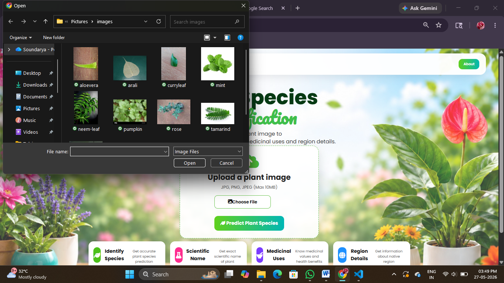
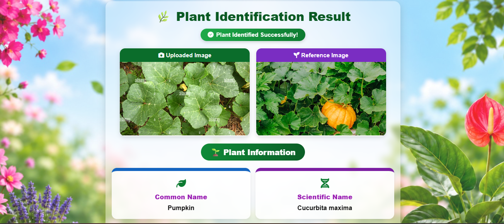
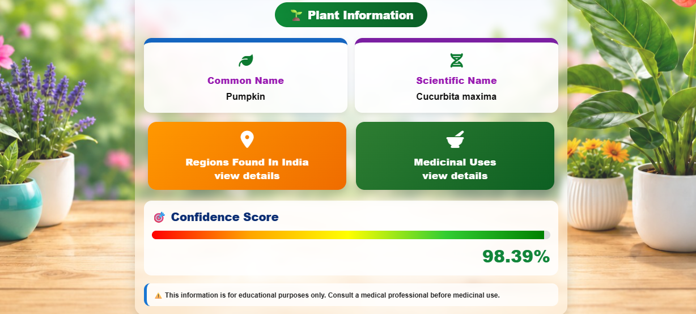
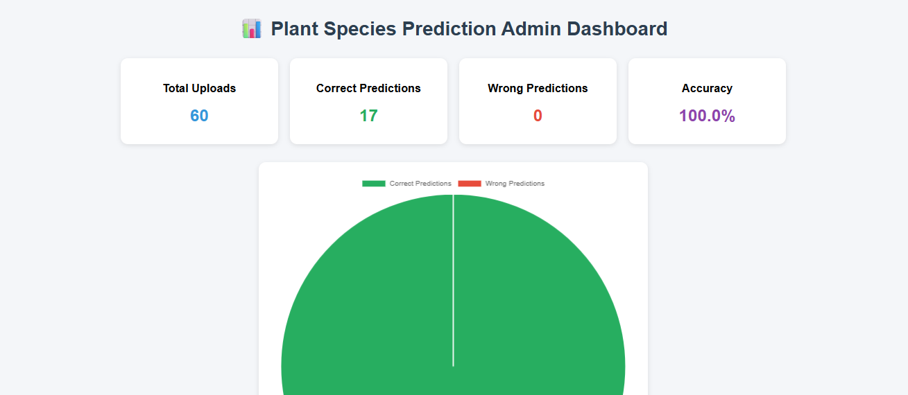

<div align="center">

# 🌿 Plant Species Identification System

### AI-Powered Medicinal Plant Identification using CNN & Flask


A Flask-based deep learning web application that identifies medicinal plant species from uploaded images using a Convolutional Neural Network (CNN). The system predicts the plant species with a confidence score and provides scientific information and medicinal uses.

⭐ If you like this project, consider giving it a star!

</div>

---

# 📖 Project Overview

The **Plant Species Identification System** is an AI-powered web application developed using **Python**, **Flask**, and **TensorFlow**.

The application allows users to upload an image of a medicinal plant. A trained **Convolutional Neural Network (CNN)** processes the image and predicts the plant species. The system then displays the predicted plant's:

- Common Name
- Scientific Name
- Confidence Score
- Medicinal Uses

An integrated **Admin Dashboard** enables monitoring of prediction history and system performance.

---

# ✨ Features

✅ Upload medicinal plant images

✅ CNN-based plant species prediction

✅ Confidence score display

✅ Common & scientific plant names

✅ Medicinal uses information

✅ User-friendly interface

✅ Prediction history

✅ Admin dashboard

✅ Responsive web design

---

# 🖥️ Project Screenshots

## 🏠 Home Page


---

## 📤 Upload Plant Image



---

## 🌿 Prediction Result

### Prediction Output



### Plant Information



---

## 📊 Admin Dashboard



---

# ⚙️ System Workflow

```text
User
   │
   ▼
Upload Plant Image
   │
   ▼
Image Preprocessing
   │
   ▼
CNN Model (.h5)
   │
   ▼
Plant Species Prediction
   │
   ▼
Display:
 • Common Name
 • Scientific Name
 • Confidence Score
 • Medicinal Uses
```

---

# 🏗️ System Architecture

```text
                +----------------------+
                |      User Upload     |
                +----------+-----------+
                           |
                           v
                +----------------------+
                | Image Preprocessing  |
                +----------+-----------+
                           |
                           v
                +----------------------+
                | CNN Model (.h5)      |
                +----------+-----------+
                           |
                           v
                +----------------------+
                | Species Prediction   |
                +----------+-----------+
                           |
        +------------------+------------------+
        |                                     |
        v                                     v
+--------------------+          +--------------------------+
| Plant Information  |          | Admin Dashboard          |
| - Common Name      |          | - Prediction History     |
| - Scientific Name  |          | - Accuracy Statistics    |
| - Medicinal Uses   |          | - Dashboard Analytics    |
| - Confidence Score |          +--------------------------+
+--------------------+
```

---

# 🛠️ Technologies Used

| Category | Technologies |
|----------|--------------|
| Programming Language | Python |
| Backend | Flask |
| Deep Learning | TensorFlow, Keras |
| Frontend | HTML, CSS, JavaScript |
| Image Processing | OpenCV, Pillow |
| Numerical Computing | NumPy |
| Data Storage | JSON |
| IDE | Visual Studio Code |
| Version Control | Git & GitHub |

---

# 📂 Project Structure

```text
Plant-Species-Identification-System
│
├── app.py
├── train_model.py
├── plant_model.h5
├── plant_info.json
├── class_indices.json
├── prediction_history.json
├── requirements.txt
├── README.md
├── LICENSE
├── .gitignore
│
├── templates/
│
├── static/
│
├── screenshots/
│   ├── home.png
│   ├── upload.png
│   ├── prediction_top.png
│   ├── prediction_bottom.png
│   └── admin_dashboard.png
│
└── ...
```

---

# 🚀 Installation

## Clone the Repository

```bash
git clone https://github.com/YOUR_USERNAME/Plant-Species-Identification-System.git
```

---

## Navigate to Project

```bash
cd Plant-Species-Identification-System
```

---

## Install Dependencies

```bash
pip install -r requirements.txt
```

---

## Run the Application

```bash
python app.py
```

---

# 📊 Model Information

| Model | CNN (Convolutional Neural Network) |
|--------|------------------------------------|
| Framework | TensorFlow / Keras |
| Input | Plant Leaf / Flower Image |
| Output | Plant Species |
| Confidence | Percentage Score |

---

# 📈 Future Enhancements

- 📱 Android Mobile Application
- 🎥 Live Camera Detection
- 🌍 Larger Plant Dataset
- ☁ Cloud Deployment
- 🌱 Plant Disease Detection
- 🌐 Multi-language Support
- 🗣 Voice Assistant Integration
- 📍 GPS-based Plant Information

---

# 👩‍💻 Author

**Soundarya Achalakar**

Bachelor of Computer Applications

📍 Karnataka, India

GitHub: https://github.com/Soundarya-Soni

---

# 📄 License

This project is licensed under the MIT License.

---

<div align="center">

### ⭐ If you found this project helpful, don't forget to star the repository!

Made with ❤️ using Python, Flask & TensorFlow

</div>